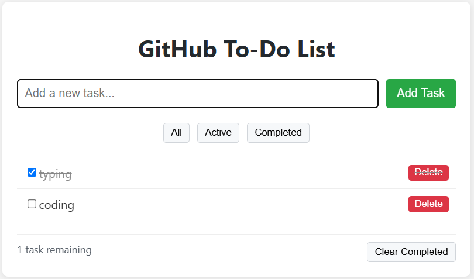

# To-Do List

A simple to-do list application that persists your tasks in the browser's localStorage.



## Features

- Add new tasks
- Mark tasks as complete
- Filter tasks (All/Active/Completed)
- Delete tasks
- Clear all completed tasks
- Task counter
- Responsive design

## Live Demo

You can view a live version of this tool at [(https://kanai6344.github.io/todo-list/)]

## How to Use

1. Clone this repository or download the files
2. Open `index.html` in your browser
3. Start managing your tasks!

## Quick Start

1. Download the project files:
   ```bash
   git clone https://github.com/kanai6344/todo-list.git
